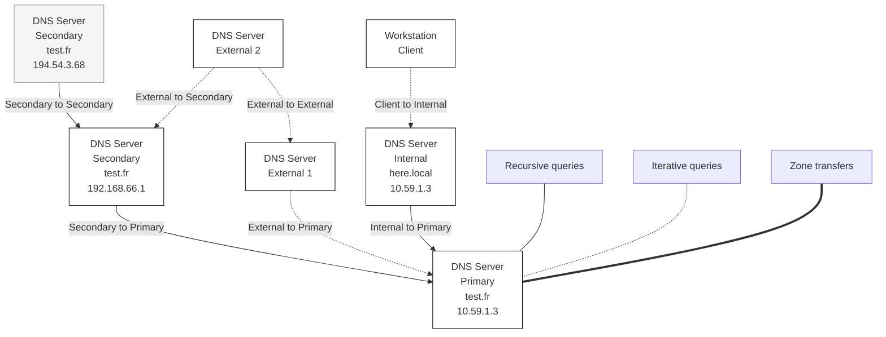

## Introduction

The figure below shows the general operation of DNS queries in an architecture with multiple DNS servers. Some of these servers (IP 192.168.69.1, 192.168.66.1, and 194.54.3.68) are associated with managing names for a fictional domain `test.fr`. Another private DNS server (IP 10.59.1.3) is associated with managing a fictional private domain (invisible from the Internet) called `here.local`. Two arbitrary external DNS servers located on the Internet are also represented.

This architecture corresponds to a situation where the company's internal DNS servers are installed in the protected area of the network, both for the domain visible from the Internet (`test.fr`) and for its local private domain (`here.local`). Since multiple DNS servers (at least two) must be available from the Internet to manage the public domain `test.fr` (this is required to be assigned a domain name), a second server is positioned in a DMZ (192.168.66.1), and a third one (194.54.3.68) is likely located at an external provider offering a truly redundant backup service.

## Implementation



In this diagram, we can distinguish different types of DNS queries that can transit on the network:

- _Recursive queries_ correspond to the requests normally made by clients to their regular DNS server, which then handles the entire name resolution protocol. It consults its cache and contacts several other DNS servers if needed to get a response or an error.
- _Iterative queries_ correspond to resolution requests generally made between DNS servers themselves. Responses to iterative queries may consist of redirecting the requester to another server, leaving the requester to continue the resolution themselves.
- _Zone transfer requests_ are made between a secondary server and the primary server for the same domain to allow the secondary server to have an up-to-date copy of the DNS zone it manages.

We also distinguish the dual role that DNS servers generally play from the perspective of information flows crossing the architecture. Indeed, they are both:

- servers in the true sense of the term that respond to incoming requests from external clients (other DNS servers) concerning the managed domain (`test.fr` in our example);
- and relays that execute outgoing DNS resolution requests on behalf of internal clients and also maintain a cache to accelerate them.

A first approach to DNS server security consists of clarifying the architecture and properly configuring the servers so that they respond to these different requests correctly based on the client's origin.

Thus, it is important to properly limit zone transfers, which distribute all information about `test.fr` at once. This limitation must be made on the primary server (IP 192.168.69.1) by identifying the secondary servers authorized to receive a copy of the zone:

```bash
zone "test.fr" {
  type master;
  file "/etc/bind/db.test.fr";
  allow-transfer {
    192.168.66.1;
    // or 194.56.3.68; (see below)
  };
};
```

But this limitation can also be made on the secondary server (IP 192.168.66.1) by specifying precisely the primary server to use for the `test.fr` zone of which it is secondary:

```bash
zone "test.fr" {
  type slave;
  masters { 192.168.69.1; };
  file "/etc/bind/bak.db.test.fr";
  allow-transfer {
    194.56.3.68; // or "none"
  };
};
```

Next, on both the primary and secondary servers, it's possible to control access to managed zones:

- iterative queries come from other servers (i.e., from the Internet);
- recursive queries come only from internal clients, i.e., end users (or their proxy).

Indeed, in the example we're following, the internal public DNS server at IP address 192.168.69.1 actually receives user queries via the internal private DNS server at address 10.59.1.3. The latter is normally its only client, except for a few exceptions (other servers, possible troubleshooting, etc.). These are the rules we apply here:

```bash
// We allow only recursive queries from the internal nameserver, the 2nd, and self
acl "ns_rzo" { 192.168.66.1; 10.59.1.3; 127.0.0.1; };
// We also allow some admin. station to do queries here directly in case of problem
acl "admin" { 192.168.65.1; };
…
  allow-query { any; }; // or "slaves_ns"
  allow-recursion { "ns_rzo"; "admin"; };
```

So here we have the case of a DNS server (IP 192.168.69.1) that contains the reference for the company's public domain (`test.fr`), which manages DNS resolution requests on the Internet on behalf of all workstations, but whose configuration allows almost only a single client. This is actually perfectly consistent with the desired flow of network traffic in the architecture.
Furthermore, since the private internal DNS server (IP 10.59.1.3) is very close to the DNS server accessing the Internet, it is not necessary to use its caching functions, which are redundant with those implemented at the next level. It is then useful to have this last server operate in pure relay mode:

```bash
options {
…
  // Allowed forwarders (only the DMZ nameservers)
  forwarders {
    192.168.69.1; 192.168.66.1;
  };
  // We *always* forward
  forward only;
…
};
```

The advantage of this type of architecture is that it provides maximum protection for the company's private internal DNS server, which absolutely does not access the Internet directly but is nevertheless able to provide all the DNS services necessary for workstations on the local network, including the resolution of names external to the company. This server is also able to resolve internal names within the company (in the here.local domain) that it manages directly. Workstations thus have transparent access to all the different domains.

## Resources
- [https://fr.wikibooks.org/wiki/Utilisateur:Rortalo/Sécurité_informatique/DNS_avec_BIND_9](https://fr.wikibooks.org/wiki/Utilisateur:Rortalo/Sécurité_informatique/DNS_avec_BIND_9)
