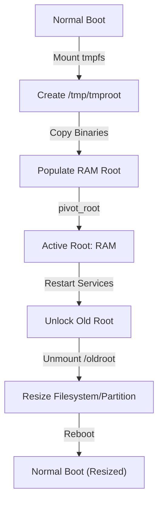

Shrinking a root filesystem usually requires unmounting it, which is impossible while the operating system is running from it. The standard solution is to boot from a LiveCD/USB or [using an initramfs hook](./shrink_root_fs_with_initramfs_hook.md). However, for remote servers (VPS, Cloud Instances) or headless devices without easy physical access, this isn't always an option.

This guide demonstrates a technique to "pivot" the root filesystem into a temporary RAM disk (`tmpfs`), allowing you to unmount the physical root device and resize it safely on a live system.

!!! failure "High Risk Operation"
    This is an **advanced and dangerous procedure**. If you make a mistake, you may lose access to the system or corrupt the filesystem.
    
    *   **Backup** your data before proceeding.
    *   Ensure you have **out-of-band access** ([KVM](https://jetkvm.com/), Serial Console, or a Hosting Provider's Recovery Console) in case SSH connectivity is lost.

## Overview

The strategy involves:



1.  Creating a minimal root filesystem in RAM (`tmpfs`).

2.  Copying essential binaries (`mount`, `ls`, `ssh`, `resize2fs`, etc.) to this RAM disk.

3.  Using `pivot_root` to swap the running root to the RAM disk.

4.  Restarting SSHD from the RAM disk to maintain connection.

5.  Unmounting the original root disk.

6.  Performing the resize operations.

7.  Pivoting back to the original root (optional, or just reboot).

## Prepare the System

Stop as many services as possible to minimize open file handles.

```bash
systemctl stop apache2 mariadb nginx docker
```

Install necessary tools if missing (e.g. `psmisc` for `fuser`):

```bash
apt-get install psmisc
```

## Create Temporary Root

Create a mount point and mount a `tmpfs` (RAM filesystem) there. This will be our new temporary "OS".

```bash
mkdir /tmp/tmproot
mount -t tmpfs none /tmp/tmproot
```

Create the directory structure:
```bash
mkdir /tmp/tmproot/{proc,sys,dev,run,usr,var,tmp,oldroot,bin,sbin,lib,lib64,mnt,etc,root}
```

Copy essential binaries and libraries. It is safer to copy "too much" than too little.

```bash
# Basic directories
cp -ax /bin /tmp/tmproot/
cp -ax /sbin /tmp/tmproot/
cp -ax /lib /tmp/tmproot/
cp -ax /lib64 /tmp/tmproot/
cp -ax /etc /tmp/tmproot/
cp -ax /root /tmp/tmproot/

# /usr binaries (often needed for sshd, python, etc.)
cp -ax /usr/bin /tmp/tmproot/usr/
cp -ax /usr/sbin /tmp/tmproot/usr/
cp -ax /usr/lib /tmp/tmproot/usr/
cp -ax /usr/lib64 /tmp/tmproot/usr/

# Var data (needed for runtime sockets, logs)
cp -ax /var/run /tmp/tmproot/var/
cp -ax /var/log /tmp/tmproot/var/
cp -ax /var/lib /tmp/tmproot/var/
```

!!! tip
    If `cp` complains about specific sockets or recursive loops, you can often ignore those errors for this purpose, provided the essential files are copied.

## Pivot Root

This is the critical moment. We will switch the system's root directory from disk to our RAM copy.

1.  **Prepare mounts**: `pivot_root` requires the mounts to be private (not shared).
    ```bash
    mount --make-rprivate /
    ```

2.  **Pivot**:
    ```bash
    pivot_root /tmp/tmproot /tmp/tmproot/oldroot
    ```

3.  **Move Kernel Mounts**: We need to move `/proc`, `/sys`, `/dev`, and `/run` to the new root so the system continues to function.
    ```bash
    for i in dev proc sys run; do mount --move /oldroot/$i /$i; done
    ```

## Restore Access

After pivoting, your current SSH session might still be technically working, but it's tied to the old root. To properly unmount the old disk later, you need to restart services so they run from the *new* RAM root.

1.  **Restart SSH**:
    ```bash
    systemctl restart sshd
    ```

    !!! important
        Verify access immediately! Open a **new** terminal window and try to SSH into the server.
        Do NOT close your existing session until you confirm you can log in again.

2.  **Reconnect**: Log out of your current session and log back in. This ensures your shell is running from the new RAM root.

## Free Up the Old Drive

Now check what processes are still holding the old filesystem (`/oldroot`).

```bash
fuser -vm /oldroot
```

You will see a list of PIDs. You need to kill or restart them.

*   **Systemd services**: Try restarting them first `systemctl restart <service>`.
*   **Stubborn processes**: Kill them. Since we are in a temporary RAM OS, it's okay to be aggressive if services aren't essential for the text console.

Example, kill everything accessing `/oldroot`:
```bash
fuser -k -v -m /oldroot
```

*Note: Be careful not to kill your own SSH session or the SSH daemon itself!*

Verify nothing is using `/oldroot`:
```bash
fuser -vm /oldroot
```
It should return empty.

## Unmount and Resize

Unmount the physical drive.

```bash
umount /oldroot
```

Now the drive is unmounted, you can proceed with standard resizing operations.

1.  **Check Filesystem**:
    ```bash
    e2fsck -f /dev/sda1
    ```

2.  **Resize Filesystem**: (Shrink to 20G for example)
    ```bash
    resize2fs /dev/sda1 20G
    ```

3.  **Resize Partition**:
    Use `fdisk`, `sfdisk`, or `parted` to resize the partition on the disk to match the new filesystem size (or slightly larger). Example using fdisk to delete and recreate larger/smaller
    
    !!! important
        Be EXTREMELY careful to use the exact same start sector!

    ```bash
    fdisk /dev/sda
    ```

## Pivot Back (Optional) or Reboot

The cleanest way to return to normal is usually to simple reboot the system. Since we modified the physical disk, a reboot ensures the kernel re-reads the partition table cleanly.

```bash
reboot
```

If you really want to pivot back without rebooting:
1.  Mount the modified physical root to `/oldroot`.
2.  `pivot_root /oldroot /oldroot/tmp/tmproot`.
3.  Move `/dev`, `/proc`, etc. back.
4.  Restart services.

However, rebooting is highly recommended after partition table changes.

## Resources
* https://unix.stackexchange.com/questions/226872/how-to-shrink-root-filesystem-without-booting-a-livecd/227318#227318