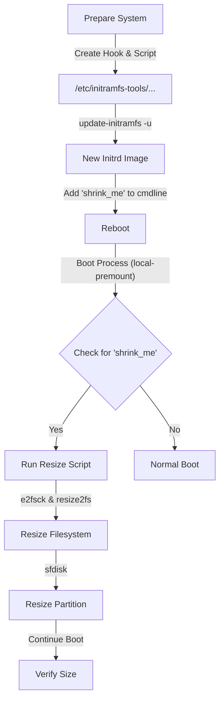

!!! note
    This guide is verified on a Raspberry Pi 5 booting from NVMe running Debian 13. The principles apply to other Debian-based systems, but device names (e.g., `/dev/sys`, `/dev/mmcblk0`) will vary.

While expanding a filesystem on Linux is a common and straightforward task (often handled automatically by scripts like `raspi-config`), **shrinking** a root filesystem is significantly more complex. The primary challenge is that you cannot shrink an `ext4` filesystem while it is mounted, and the root filesystem is mounted almost immediately during the boot process.

This tutorial demonstrates how to perform this operation safely by using a custom **initramfs** hook. This allows us to intercept the boot process in the `local-premount` stage—after hardware detection but *before* the root filesystem is mounted—to perform file system and partition resizing operations.

## Overview of the Process



1.  **Create a Hook Script**: To ensure necessary tools (`resize2fs`, `e2fsck`, `sfdisk`) are included in the initramfs image.
2.  **Create the Resize Script**: A script that runs during boot to perform the actual resizing.
3.  **Update Initramfs**: Generate the new boot image.
4.  **Trigger the Resize**: Reboot with a specific kernel command line argument.

## Prepare the System

First, identify your root partition and disk.
```bash
$ df -h /
Filesystem      Size  Used Avail Use% Mounted on
/dev/nvme0n1p2  1.8T  8.1G  1.8T   1% /
```
In this example:
- **Disk**: `/dev/nvme0n1`
- **Partition**: `/dev/nvme0n1p2` (Partition 2)

Ensure your initramfs configuration allows loading modules needed for your storage. For NVMe drives, we explicitly add the modules. Add nvme modules to `/etc/initramfs-tools/modules`:

```bash
echo "nvme" >> /etc/initramfs-tools/modules
echo "nvme_core" >> /etc/initramfs-tools/modules
```

Ensure `auto_initramfs` is enabled in your firmware config:

=== "/boot/firmware/config.txt"

    ```bash
    auto_initramfs=1
    ```

## Create the Initramfs Hook

We need a hook script to copy the binary tools into the initramfs image. Create `/etc/initramfs-tools/hooks/resize_tools` with the following content:

=== "/etc/initramfs-tools/hooks/resize_tools"

    ```bash
    #!/bin/sh

    PREREQ=""

    prereqs() {
        echo "$PREREQ"
    }

    case "$1" in
        prereqs)
            prereqs
            exit 0
            ;;
    esac

    . /usr/share/initramfs-tools/hook-functions

    # Copy binaries required for resizing
    copy_exec /sbin/e2fsck
    copy_exec /sbin/resize2fs
    copy_exec /sbin/sfdisk
    copy_exec /usr/bin/awk
    copy_exec /usr/bin/grep
    ```

Make it executable:
```bash
chmod +x /etc/initramfs-tools/hooks/resize_tools
```

## Create the Resize Script

Create the script that will actually run during the boot process at `/etc/initramfs-tools/scripts/local-premount/shrink_root`.

!!! warning
    **Hardcoded Values**: This script has hardcoded values for the device (`/dev/nvme0n1p2`) and the target sizes (`68G` for filesystem, `70G` for partition). You **MUST** edit these to match your requirements.
    
    When shrinking, always resize the **filesystem** to be slightly smaller than the target **partition** size to avoid data corruption. In this example: FS = 68G, Partition = 70G.

=== "/etc/initramfs-tools/scripts/local-premount/shrink_root"

    ```bash
    #!/bin/sh

    PREREQ=""

    prereqs() {
        echo "$PREREQ"
    }

    case "$1" in
        prereqs)
            prereqs
            exit 0
            ;;
    esac

    # Function to log messages
    log_msg() {
        echo "FS-RESIZE: $1"
    }

    # Check kernel command line for the trigger
    if ! grep -q "shrink_me" /proc/cmdline; then
        exit 0
    fi

    log_msg "Trigger detected. Scanning devices..."

    # Target Device Configuration
    DEV_PART="/dev/nvme0n1p2"  # The partition to resize
    DEV_DISK="/dev/nvme0n1"    # The physical disk
    PART_NUM="2"               # Partition number
    TARGET_FS_SIZE="68G"       # Target filesystem size (must be < partition size)
    TARGET_PART_SIZE="70G"     # Target partition size

    # Wait for device to appear
    count=0
    while [ ! -b "$DEV_PART" ]; do
        sleep 1
        count=$((count + 1))
        if [ $count -gt 10 ]; then
            log_msg "Device $DEV_PART not found!"
            exit 1
        fi
    done
    log_msg "$DEV_PART found at attempt $count."

    # 1. Check Filesystem
    log_msg "Starting e2fsck..."
    e2fsck -f -y "$DEV_PART" || log_msg "Fsck reported errors (code $?)"

    # 2. Resize Filesystem
    log_msg "Resizing FS to $TARGET_FS_SIZE..."
    resize2fs "$DEV_PART" "$TARGET_FS_SIZE"
    if [ $? -ne 0 ]; then
        log_msg "Resize2fs failed! Aborting partition resize."
        exit 1
    fi

    # 3. Resize Partition using sfdisk
    log_msg "Resizing Partition to $TARGET_PART_SIZE..."
    # sfdisk syntax: <start>, <size>, <type>, <bootable>
    # We only want to change the size. 
    # NOTE: This command assumes standard partition layout. 
    # It tells sfdisk to keep the start sector, set size to 70G, and preserve other attributes.
    echo ", $TARGET_PART_SIZE" | sfdisk -N "$PART_NUM" --force "$DEV_DISK"

    if [ $? -eq 0 ]; then
        log_msg "Operation finished."
    else
        log_msg "Partition resize failed."
    fi
    ```

Make it executable:
```bash
chmod +x /etc/initramfs-tools/scripts/local-premount/shrink_root
```

## Update Initramfs

Regenerate your initramfs images to include the new scripts and tools.

```bash
update-initramfs -u
```
*Verify that there are no errors in the output.*

## Trigger the Resize

To trigger the script, we need to add the `shrink_me` parameter to the kernel command line.

Edit `/boot/firmware/cmdline.txt` and append `shrink_me` to the end of the line (make sure it's on the same line, separated by a space). Example content of `/boot/firmware/cmdline.txt`:

=== "/boot/firmware/cmdline.txt"

    ```bash
    console=serial0,115200 console=tty1 root=PARTUUID=183364d5-02 rootfstype=ext4 fsck.repair=yes rootwait shrink_me
    ```

## Reboot and Verify

Reboot your Raspberry Pi.
```bash
reboot
```

You can monitor the process if you have a serial console or display attached. Look for the `FS-RESIZE` messages in the boot logs.

After the system comes back online:

* Check the new size:
    ```bash
    df -h /
    # Filesystem      Size  Used Avail Use% Mounted on
    # /dev/nvme0n1p2   69G  8.1G   59G  13% /
    ```

* Remove the trigger from `/boot/firmware/cmdline.txt` to prevent it from running again (though the script is safe to run as resize2fs does nothing if size matches).

* Clean up by removing the hook and script files and running `update-initramfs -u` again.
