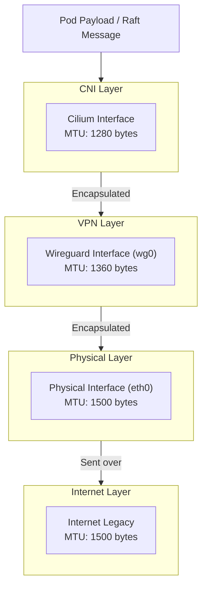

## Introduction

[K3s](https://k3s.io/) is a lightweight Kubernetes distribution that is designed to be easy to install and use. It is a great way to run a Kubernetes cluster in a home lab.

In this documentation, I assume you're running a Linux server on [Debian](https://www.debian.org/).

## Requirements

You can find a list of requirements on the [K3s website](https://docs.k3s.io/installation/requirements). Basically the most important thing is to disable the firewall system to not overlap with the k3s network.

## Installation

To install k3s on multiple nodes, its is preferable to use a configuration management tool like [Ansible](../../Configuration%20Managers/index.md).

Here we'll see how to install k3s on a single node manually for simplicity. K3s has 2 roles:

- Server (K3s Control plane)
- Agent (K3s client/workers)

On large cluster, you generally have 3 (or more) dedicated nodes for the control plane and the rest for the workers. But here we'll keep it simple and run the control plane and the worker on the same node.

Start by creating a file to configure the kubelet:

=== "kubelet.config"

    ```yaml
    apiVersion: kubelet.config.k8s.io/v1beta1
    kind: KubeletConfiguration
    shutdownGracePeriod: 180s
    shutdownGracePeriodCriticalPods: 60s
    failSwapOn: false
    featureGates:
        NodeSwap: true
    memorySwap:
        swapBehavior: LimitedSwap
    ```

Then run this command with root privileges:

```
curl -sfL https://get.k3s.io | INSTALL_K3S_EXEC="--kubelet-arg 'config=/etc/rancher/k3s/kubelet.config' --etcd-expose-metrics --flannel-backend=none --disable-network-policy --disable=traefik --disable=metrics-server --disable servicelb --bind-address=0.0.0.0" sh -
```

- `etcd-expose-metrics` is used to expose the etcd metrics to the Prometheus server.
- `flannel-backend=none` is used to disable the flannel network plugin because I prefer using [Cilium](https://docs.cilium.io/en/stable/) for the network policy.
- `disable-network-policy` required by Cilium.
- `disable=traefik` you can keep it, but I prefer letting [Qovery](https://qovery.com/) handle the ingress with Nginx.
- `disable=metrics-server` same here, I prefer using [Qovery](https://qovery.com/) for the metrics.
- `disable servicelb` we'll use [metallb](./metallb_lb_k8s.md) for the load balancer.
- `bind-address=0.0.0.0` is used to bind the kubelet to all interfaces.

## Graceful shutdown

I personaly don't like how k3s shutdown the server when a reboot is triggered. It's not graceful and dangerous if you're hosting stateful apps likes databases.

To gracefully shutdown the k3s server, you can use this script:

=== "/usr/local/bin/k3s-node-drain.sh"

    ```bash
    #!/bin/bash
    set -e

    # Get the node name
    NODE_NAME=$(hostname)

    # Log the start of drain process
    echo "Starting drain of node ${NODE_NAME} before reboot" | systemd-cat -t k3s-drain

    # Attempt to drain the node
    if kubectl drain ${NODE_NAME} --ignore-daemonsets --delete-emptydir-data --timeout=300s --grace-period=120; then
        echo "Successfully drained node ${NODE_NAME}" | systemd-cat -t k3s-drain
        exit 0
    else
        echo "Failed to drain node ${NODE_NAME}, but continuing with reboot" | systemd-cat -t k3s-drain
        # We still exit with 0 to allow the reboot to proceed
        exit 0
    fi
    ```

Then create a systemd service to run it on reboot/shutdown:

=== "/etc/systemd/system/k3s-node-drain.service"

    ```ini
    [Unit]
    Description=Drain K3s node before shutdown
    # Start after k3s, and stops before k3s stops (systemd reverse dependency logic)
    After=k3s.service
    Requires=k3s.service

    [Service]
    Type=oneshot
    RemainAfterExit=yes
    Environment=KUBECONFIG=/etc/rancher/k3s/k3s.yaml
    # Dummy start command as we only care about stop action
    ExecStart=/bin/true
    # The actual drain happens on stop
    ExecStop=/usr/local/bin/k3s-node-drain.sh
    TimeoutStopSec=300

    [Install]
    WantedBy=multi-user.target
    ```

Finally set execution permissions and enable the service:

```bash
chmod +x /usr/local/bin/k3s-node-drain.sh
systemctl enable k3s-node-drain.service
systemctl daemon-reload
```

You can now reboot the server and see that pods are gracefully shutdown:

```bash
kubectl get po --watch
```

## TLS SAN

You can add additional SAN to the k3s certificate with the following configuration:

=== "/etc/rancher/k3s/kubelet.config"

    ```yaml
    extraSan:
    - my_new_ip
    - my.local.domain
    - my.external.domain
    ```

This will help you to get the certificate working with your local domain and external domain. It starts to be useful when you want to use a load balancer in front of your API cluster, so redirection to any API server will be valid.

### Load balanced Kubernetes API

To get the API load balancing working, you can use [metallb](./metallb_lb_k8s.md) or [Cilium L2 Advertisment](./cilium.md). We'll see here how to do it with Cilium L2 (it's just the annotation changing).

By default Kubernetes provides a `kubernetes` service in the `default` namespace with `endpoints` resources generated Kubernetes itself. Unfortunately we can't use this service to get the API load balancing working. We have to create our own endpoints.

Here we're going to use Helm to simplify the process and generate endpoints based on the original `kubernetes` service:

=== "kubernetes-api-ha.yaml"

    ```yaml
    
    apiVersion: v1
    kind: Service
    metadata:
    name: kubernetes-api-ha
    namespace: default
    annotations:
        # set the IP you want to use for the load balancer
        lbipam.cilium.io/ips: "x.x.x.x"
    spec:
    type: LoadBalancer
    internalTrafficPolicy: Cluster
    ports:
    - name: https
        port: 443
        protocol: TCP
        targetPort: 6443
    ---
    apiVersion: v1
    kind: Endpoints
    metadata:
    name: kubernetes-api-ha
    namespace: default
    {{- $apiEndpoints := (lookup "v1" "Endpoints" "default" "kubernetes") }}
    {{- $ips := list }}
    {{- if $apiEndpoints }}
    {{- range $subset := $apiEndpoints.subsets }}
        {{- range $address := $subset.addresses }}
        {{- $ips = append $ips $address.ip }}
        {{- end }}
    {{- end }}
    {{- else }}
    {{- $ips = .Values.kubernetesApiHa.ips }}
    {{- end }}
    subsets:
    - addresses:
    {{- range $ips }}
    - ip: {{ . }}
    {{- end }}
    ports:
    - port: 6443
        name: https
        protocol: TCP
    
    ```

Update the `lbipam.cilium.io/ips` annotation with the IP you want to use for the load balancer. Then when you deploy it, Cilium will create a load balancer with the IP you specified and the endpoints will be the same as the original `kubernetes` service.

Then update your kubeconfig to use the load balancer IP with the load balanced IP you've selected above:

=== "~/.kube/config"

    ```yaml
    
    apiVersion: v1
    kind: Config
    clusters:
    - name: k3s
        cluster:
        server: https://x.x.x.x
    
    ```

## Worker node behind Wireguard

If you connect some remote node with Wireguard, you will certainly face to Prometheus error [`KubeAggregatedAPIDown`](https://runbooks.prometheus-operator.dev/runbooks/kubernetes/kubeaggregatedapidown/) and K3s/etcd Raft logs error `dropped internal Raft message since sending buffer is full`.

!!! question "What is Raft?"

    [Raft](https://en.wikipedia.org/wiki/Raft_(algorithm)) is a consensus algorithm used by distributed systems to maintain consistency across multiple nodes. On Kubernetes, etcd uses Raft to maintain consistency across multiple nodes.

This is due to the fact that the default MTU of the Wireguard interface (`wg0`) is around 1360 bytes, which is smaller than the default MTU of the underlying network interface, like [Cilium CNI](./cilium.md). Your CNI may have an MTU autodetect mechanism, but it's not bullet proof. This causes the Raft messages to be fragmented, which in turn causes the Raft protocol to fail.

If you're running in an enterprise environment, enabling [Jumbo Frames](https://en.wikipedia.org/wiki/Jumbo_frame) and raise the wireguard MTU around 8940, and network card to 9000 could solve the issue.

In a case you have to deal with most of the internet network (like home labs for example), you'll have to deal with the legacy MTU, set to 1500 and we have to lower our own MTU.

First you need ensure that the Wireguard MTU is lower than the network interface. In your Wireguard config, set the MTU on the Wireguard interface and enable [`TCP MSS Clamping`](https://www.cloudflare.com/th-th/learning/network-layer/what-is-mss/) to avoid fragmentation:

=== "/etc/wireguard/wg0.conf"

    ```ini
    [Interface]
    MTU = 1360
    PostUp = iptables -t mangle -I POSTROUTING -o wg0 -p tcp --tcp-flags SYN,RST SYN -j TCPMSS --clamp-mss-to-pmtu
    PreDown = iptables -t mangle -D POSTROUTING -o wg0 -p tcp --tcp-flags SYN,RST SYN -j TCPMSS --clamp-mss-to-pmtu
    ...
    ```

Then, we'll update the MTU of the CNI. If you're using [Cilium](./cilium.md) with its helm chart, simply add this to your configuration (warning: VXLAN overhead +50 bytes):

=== "values.yaml"

    ```yaml
    MTU: 1280
    ```

To make it clear, here is global picture:



Finally, restart your k3s and wireguard service:

```bash
systemctl restart k3s.service
systemctl restart wg-quick@wg0.service
```

If you observe Etcd logs through Prometheus, you should see a better result with this query:

```
histogram_quantile(0.99, sum by (le) (rate(etcd_request_duration_seconds_bucket[5m])))
```

{ .no-border width=800 }
