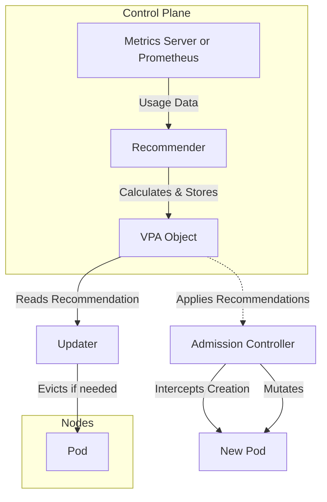
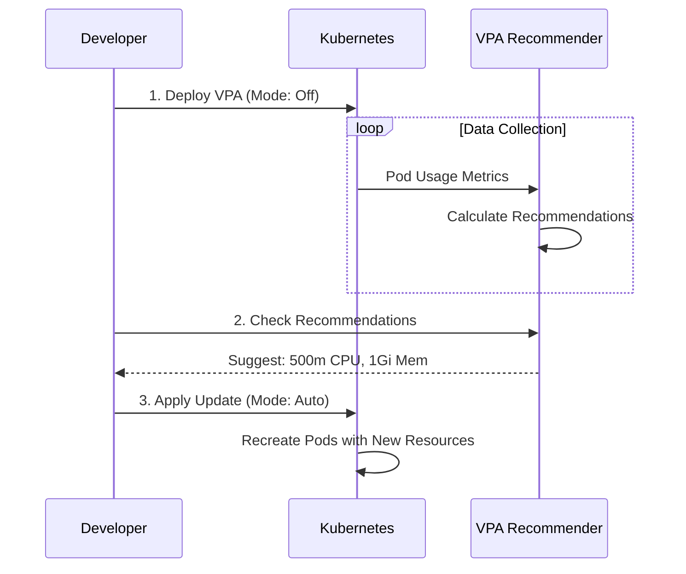

## Introduction

The [Vertical Pod Autoscaler (VPA)](https://kubernetes.io/docs/concepts/workloads/autoscaling/vertical-pod-autoscaler/) frees you from the need to manually set up CPU and memory requests and limits for your containers. It automatically adjusts these values based on historical usage analysis to "right-size" your pods.

Unlike the [Horizontal Pod Autoscaler (HPA)](https://kubernetes.io/docs/concepts/workloads/autoscaling/horizontal-pod-autoscale/), which scales out by adding more pod replicas, VPA scales up/down by allocating more or less resources to existing pods. It helps you to optimize resources usage, reduce costs, and help to absorb spikes in traffic.

!!! warning

    You should generally **not** use VPA and HPA on the same resource (CPU/Memory) for the same workload, as they will conflict. If you need both, use HPA on custom metrics (like QPS) and VPA on CPU/Memory, or use a [Multidimensional Pod Autoscaling](https://docs.cloud.google.com/kubernetes-engine/docs/how-to/multidimensional-pod-autoscaling), reserved for GKE.

## How it works

VPA consists of three main components:

1.  **Recommender**: Monitors resource utilization and events (like OOM kills) to calculate recommended values.
2.  **Updater**: Checks if a pod's current resources deviate significantly from recommendations and decides if it should be updated.
3.  **Admission Controller**: A webhook that intercepts pod creation requests to apply the recommended resources to new pods.



## Installation

VPA is not part of the standard Kubernetes control plane and needs to be installed separately. We can install it using a Helm chart:

```bash
helm repo add fairwinds-stable https://charts.fairwinds.com/stable
helm install my-vpa fairwinds-stable/vpa --version 4.10.1
```

### Customization

Here is a `values.yaml` file to customize the installation:

!!! note

    This is a minimal configuration. You may adjust the values based on your needs, and add more replicas for high availability.

=== "values-overrides.yaml"

    ```yaml
    recommender:
      enabled: true
      extraArgs:
        v: "4"
        # define minimum recommended resources
        pod-recommendation-min-cpu-millicores: 50
        pod-recommendation-min-memory-mb: 32
        # Optional: Prometheus service 
        storage: "prometheus"
        prometheus-address: "http://prometheus.monitoring.svc"
        prometheus-cadvisor-job-name: "kubelet"
        container-pod-name-label: pod
        container-name-label: container
        metric-for-pod-labels: kube_pod_labels{job="kube-state-metrics"}[8d]
        pod-namespace-label: namespace
        pod-name-label: pod
      # Add more replicas for high availability
      replicaCount: 1
      resources:
        requests:
          cpu: 50m
          memory: 600Mi
        limits:
          cpu: 200m
          memory: 600Mi
      # Enable pod monitoring if you want to use pod monitors to track resource usage (requires Prometheus)
      podMonitor:
        enabled: true

    updater:
      enabled: true
      extraArgs:
        # If you run Kubernetes >= 1.33, you can use InPlaceOrRecreate to update resources without restarting the pod
        "feature-gates": "InPlaceOrRecreate=true"
        # Allow VPA to update pods with less than 1 replica (warning: will produce downtime on pod restart)
        # So you should be ok with this behavior
        "min-replicas": 1
      resources:
        requests:
          cpu: 50m
          memory: 500Mi
        limits:
          cpu: 200m
          memory: 500Mi
      # Enable pod monitoring if you want to use pod monitors to track resource usage (requires Prometheus)
      podMonitor:
        enabled: true

    admissionController:
      enabled: true
      extraArgs:
        # If you run Kubernetes >= 1.33, you can use InPlaceOrRecreate to update resources without restarting the pod
        "feature-gates": "InPlaceOrRecreate=true"
      registerWebhook: true
      resources:
        requests:
          cpu: 50m
          memory: 500Mi
        limits:
          cpu: 200m
          memory: 500Mi
    ```

By default, the VPA will use [metrics-server](https://github.com/kubernetes-sigs/metrics-server) to collect resource usage data and define recommendations.

!!! tip
    
    If you want better recommendations based on more historical data, you can enable the Prometheus support by specifying the `prometheus-address` and `storage: "prometheus"` in the recommender extra args.

## Configuration

Let's look at a standard VPA configuration targeting a Deployment.

=== "vpa.yaml"

    ```yaml
    apiVersion: autoscaling.k8s.io/v1
    kind: VerticalPodAutoscaler
    metadata:
      name: my-app-vpa
    spec:
      # The target workload to scale (Deployment, StatefulSet, etc.)
      targetRef:
        apiVersion: "apps/v1"
        kind: Deployment
        name: my-app
      # How VPA applies changes: "Off", "Initial", "Recreate", "InPlaceOrRecreate, or "Auto"
      updatePolicy:
        updateMode: "Off"
      # Fine-grained control over resources
      resourcePolicy:
        containerPolicies:
          - containerName: '*' # Apply to all containers inside the pod
            # Lower bound: VPA will never recommend less than this
            minAllowed:
              cpu: 100m
              memory: 250Mi
            # Upper bound: VPA will never recommend more than this
            maxAllowed:
              cpu: 1
              memory: 1Gi
            # Which resources to manage
            controlledResources: ["cpu", "memory"]
    ```

Then wait a few seconds, and describe the VPA, you'll see in the coming minutes the recommendations. Example:

```bash hl_lines="29-43"
$ kubectl describe vpa -n cert-manager cert-manager-vpa

Name:         cert-manager-vpa
Namespace:    cert-manager
Labels:       app.kubernetes.io/managed-by=Helm
Annotations:  meta.helm.sh/release-name: cert-manager-config
              meta.helm.sh/release-namespace: cert-manager
API Version:  autoscaling.k8s.io/v1
Kind:         VerticalPodAutoscaler
...
Spec:
  Resource Policy:
    Container Policies:
      Container Name:  *
      Max Allowed:
        Cpu:     500m
        Memory:  300Mi
      Min Allowed:
        Cpu:     10m
        Memory:  50Mi
  Target Ref:
    API Version:  apps/v1
    Kind:         Deployment
    Name:         cert-manager
  Update Policy:
    Update Mode:  InPlaceOrRecreate
Status:
...
  Recommendation:
    Container Recommendations:
      Container Name:  cert-manager-controller
      Lower Bound:
        Cpu:     50m
        Memory:  50Mi
      Target:
        Cpu:     50m
        Memory:  50Mi
      Uncapped Target:
        Cpu:     50m
        Memory:  49566436
      Upper Bound:
        Cpu:     241m
        Memory:  300Mi
Events:          <none>
```

## Update Modes

The `updateMode` controls how VPA applies changes to your pods.

| Mode | Description |
| :--- | :--- |
| **`Off`** | VPA only generates recommendations but does not apply them. Perfect for observing what VPA *would* do without touching production traffic. |
| **`Initial`** | VPA applies resources only when a pod is created. It will not change resources of running pods. |
| **`Recreate`** | VPA evicts pods that need updating, forcing the controller (e.g., Deployment) to recreate them with new resources. |
| **`Auto`** | Currently an alias for `Recreate`. |
| **`InPlaceOrRecreate`** | Tries to update resources without restarting the pod. If not possible, it falls back to evicting/recreating the pod. |

### In-Place Pod Resizing

Traditionally, changing a Pod's resources required a restart. However, with the `InPlacePodVerticalScaling` feature, Kubernetes can resize pods without restarting the containers.

When using `updateMode: "InPlaceOrRecreate"`, VPA leverages this capability.

We can control the restart behavior using the `resizePolicy` in your Pod spec (inside a Deployment, StatefulSet, etc.):

```yaml hl_lines="6 8"
spec:
  containers:
  - name: my-container
    resizePolicy:
    - resourceName: cpu
      restartPolicy: NotRequired  # Default behavior
    - resourceName: memory
      restartPolicy: RestartContainer # Force restart for memory changes
```

!!! tip
    **Why restart?** Some applications, like Java (JVM) or Node.js, read memory settings (e.g., `-Xmx`) only at startup. Changing the cgroup memory limit on the fly won't automatically resize the heap, so a restart is safer to ensure the app picks up the new limit.


## Workflow: From Observation to Update



1.  **Deploy in `Off` Mode**: Create the VPA object with `updateMode: "Off"`.
2.  **Wait**: Let the application run under realistic load for at least 24 hours (or a full traffic cycle).
3.  **Inspect Recommendations**:
    ```bash
    kubectl describe vpa my-app-vpa
    ```
    Look for the `Recommendation` section:
    *   **Target**: The ideal value.
    *   **Lower Bound**: The minimum value VPA is confident in.
    *   **Upper Bound**: The maximum value VPA is confident in.

    You can also use Prometheus/Grafana to [visualize the recommendations](https://grafana.com/grafana/dashboards/16294-vpa-recommendations/) and make informed decisions:

    
4.  **Apply**:
    *   Manually update your Deployment manifests with the `Target` values.
    *   OR change `updateMode` to `Recreate` / `InPlaceOrRecreate` to let VPA handle it.

## Best Practices

*   **PDBs**: Ensure you have **Pod Disruption Budgets** configured. VPA respects them, so it won't evict too many pods at once during updates.
*   **OOM Handling**: VPA reacts to OOM events. If a pod gets OOMKilled, VPA will increase the memory recommendation to prevent it from happening again.
*   **Golden Metrics**: Use VPA recommendations as a guide to set baseline requests/limits in your GitOps manifests, even if you don't use auto-updates.
