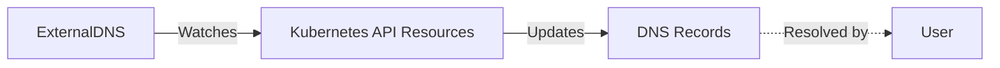

{ .title }

Manually managing DNS records for every new service or application deployed on Kubernetes is a pain. It's slow, error-prone, and frankly, we have better things to do.

[ExternalDNS](https://github.com/kubernetes-sigs/external-dns) solves this by sitting inside your cluster, watching your Kubernetes resources (like Services, Ingresses, and Gateways), and automatically creating or updating the corresponding DNS records in your provider (like [Cloudflare](https://www.cloudflare.com/), [AWS Route53](https://aws.amazon.com/route53/), or [Google Cloud DNS](https://cloud.google.com/dns)).

When you delete a service, it cleans up the DNS record. It just works.

## How it works

ExternalDNS operates as a pod within your cluster that securely talks to your DNS provider's API. Here is the flow:



## Configuration

Let's look at a production-ready configuration for Cloudflare. This setup handles standard Services and the newer Gateway API.

=== "values-overrides.yaml"

    ```yaml
    # Enable Prometheus metrics so we can monitor DNS sync status
    serviceMonitor:
      enabled: true

    # Default log level. Useful to switch to 'debug' if records aren't appearing
    logLevel: info

    # How often to check for changes. 1m is a good balance.
    interval: 1m

    # Immediately process changes instead of waiting for the next interval
    triggerLoopOnEvent: true

    # Watch for Gateway API resources in a specific namespace (optional)
    gatewayNamespace:

    # add here the kind of services you want external-dns to watch
    sources:
      - service           # Watch Services
      - gateway-httproute # Watch Gateway API HTTPRoutes

    # 'sync' means it creates AND deletes records.
    # Use 'upsert-only' if you're afraid of it deleting existing records.
    policy: sync

    # Ownership Registry: crucial for safety.
    # ExternalDNS creates a TXT record alongside the A record to mark it as "managed by ExternalDNS".
    # It ensures it doesn't mess with records it didn't create.
    registry: txt
    # change it with the cluster name or any unique identifier if you plan to have multiple external-dns instances pointing to the same dns name
    txtOwnerId: external-dns
    txtPrefix: external-dns

    # We are using Cloudflare
    provider:
      name: cloudflare

    # Securely pass the API Token
    env:
      - name: CF_API_TOKEN
        valueFrom:
          secretKeyRef:
            name: cloudflare-api-key
            key: apiKey

    # Cloudflare specific flags
    extraArgs:
      - --cloudflare-proxied # Enable the "Orange Cloud" (CDN + DDoS protection)
      - --cloudflare-dns-records-per-page=5000
      - --cloudflare-record-comment="provisioned by external-dns" # Helpful comment in Cloudflare UI

    resources:
      requests:
        cpu: 10m
        memory: 100Mi
      limits:
        cpu: 100m
        memory: 100Mi
    ```

## Installation

We install ExternalDNS using its Helm chart. It's the standard way to deploy it.

```bash
helm repo add external-dns https://kubernetes-sigs.github.io/external-dns/
helm install my-external-dns external-dns/external-dns --version 1.20.0 -f values-overrides.yaml
```

We're now ready to deploy DNS :)

## Manage records

### Exposing a Service

To expose a standard `Service`, you just need to add the `external-dns.alpha.kubernetes.io/hostname` annotation. ExternalDNS sees this, will get the LoadBalancer IP from the `Service` and creates the A record.

=== "service.yaml"

    ```yaml hl_lines="6"
    apiVersion: v1
    kind: Service
    metadata:
      name: my-service
      annotations:
        external-dns.alpha.kubernetes.io/hostname: "myapp.example.com"
    spec:
      type: LoadBalancer
      ports:
      - port: 80
        targetPort: 8080
      selector:
        app: myapp
    ```

### Exposing a Gateway HTTPRoute

If you are using the [Gateway API](../Containers/Kubernetes/gateway-api.md), ExternalDNS can watch your `HTTPRoute` resources. Unlike Services, you often define the hostname directly in the rule hostnames, and ExternalDNS picks it up automatically.

=== "httproute.yaml"

    ```yaml
    apiVersion: gateway.networking.k8s.io/v1
    kind: HTTPRoute
    metadata:
      name: my-route
      namespace: default
    spec:
      parentRefs:
      - name: gateway
      hostnames:
      - "gateway-app.example.com" # ExternalDNS creates this record
      rules:
      - backendRefs:
        - name: my-service
          port: 8080
    ```

### Useful annotations

There are many other useful annotations you can use to control how ExternalDNS behaves. Here are a few:

* `external-dns.alpha.kubernetes.io/target`: The target IP address to create (comma separated for multiple targets).
* `external-dns.alpha.kubernetes.io/ttl`: The TTL of the record.

Other annotations are "Provider" specific like Cloudflare for their `Proxied` option. You can find the full list of annotations in the [official documentation](https://kubernetes-sigs.github.io/external-dns/latest/docs/annotations/annotations/).

### Manual records

ExternalDNS can also create records manually by using its CRDs! This is useful if you want to separate your DNS management from your Kubernetes resources. Here is a basic example for a A record:

```yaml
apiVersion: externaldns.k8s.io/v1alpha1
kind: DNSEndpoint
metadata:
  name: example-a-record
spec:
  endpoints:
  - dnsName: mydomain.com
    recordTTL: 60
    recordType: A
    targets:
    - 1.2.3.4
```    

!!! note

    All the record types are not enabled by default, so the required record types must be enabled by using `--managed-record-types=A` in the `extraArgs` section of the external-dns chart:

    ```yaml
    extraArgs:
      - --managed-record-types=CNAME
      - --managed-record-types=NS
      - --managed-record-types=A
      - --managed-record-types=MX
      ...
    ```

## Resources

* [ExternalDNS Official Documentation](https://kubernetes-sigs.github.io/external-dns/latest/)