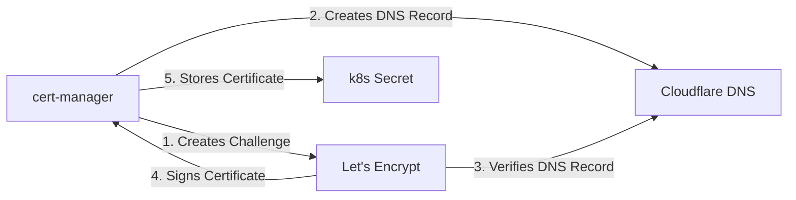
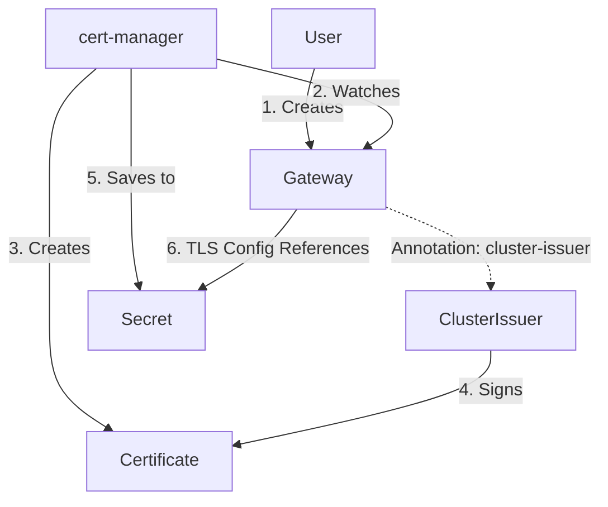
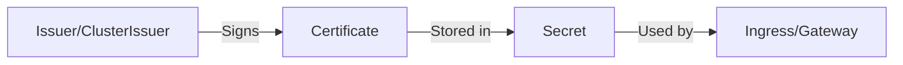

{ .title }

## Introduction

[Cert-Manager](https://cert-manager.io/) is a native Kubernetes certificate management controller. It can help with issuing certificates from a variety of sources, such as [Let's Encrypt](https://letsencrypt.org/), [HashiCorp Vault](https://www.vaultproject.io/), a simple signing key pair, or self-signed.

It will ensure certificates are valid and up to date, and attempt to renew certificates at a configured time before expiry.

## Installation

We will install cert-manager using Helm. Below is the configuration `values.yaml` we will use to configure it.

### Configuration

Let's create a file named `values-override.yaml` with minimal values to install cert-manager following content:

=== "values-override.yaml"

    ```yaml
    global:
      nodeSelector: {}
      # Depending on the criticity of this service for you, you can set a priority class
      priorityClassName: "system-cluster-critical"

    crds:
      enabled: true
      keep: true

    # For production, use more than 1 replica
    replicaCount: 1

    resources:
      requests:
        memory: "100Mi"
        cpu: "10m"
      limits:
        memory: "100Mi"
        cpu: "200m"

    # Enable metrics for prometheus
    prometheus:
      enabled: true
      podmonitor:
        enabled: true

    webhook:
      resources:
        requests:
          memory: "100Mi"
          cpu: "10m"
        limits:
          memory: "100Mi"
        cpu: "200m"

    cainjector:
      enabled: true
      replicaCount: 1
      resources:
        requests:
          memory: "100Mi"
          cpu: "10m"
        limits:
          memory: "100Mi"
        cpu: "200m"

    # Required for Gateway API support
    config:
      apiVersion: controller.config.cert-manager.io/v1alpha1
      kind: ControllerConfiguration
      enableGatewayAPI: true
    ```

### Install with Helm

Let's run the following command to install cert-manager:

```bash
helm repo add jetstack https://charts.jetstack.io
helm repo update
helm install cert-manager jetstack/cert-manager -n cert-manager --create-namespace  --values values-override.yaml
```

## Configuring Issuers

Issuers, and ClusterIssuers, are resources that represent certificate authorities (CAs) that are able to generate signed certificates by honoring certificate signing requests. All cert-manager certificates require a referenced issuer that is in a ready condition to attempt to honor the request.

!!! note "Difference between Issuer and ClusterIssuer"

    The difference between Issuer and ClusterIssuer is that ClusterIssuer is cluster scoped, while Issuer is namespace scoped.

### Cloudflare & Let's Encrypt with ClusterIssuer

Here is an example of a `ClusterIssuer` that uses Cloudflare for DNS01 challenge validation with Let's Encrypt.



We'll see here only the ClusterIssuer configuration for simplicity (one wildcard certificate for all subdomains of `mydomain.com`). But the process is close to the same for a single certificate.

Let's create the ClusterIssuer containing Cloudflare information the the ACME protocol:

=== "cluster-issuer.yaml"

    ```yaml
    apiVersion: cert-manager.io/v1
    kind: ClusterIssuer
    metadata:
      name: cloudflare-letsencrypt
    spec:
      acme:
        email: YOUR_EMAIL@example.com
        # Use Let's Encrypt staging environment (strongly advised during testing and avoid being blacklisted for a while)
        # server: https://acme-staging-v02.api.letsencrypt.org/directory
        server: https://acme-v02.api.letsencrypt.org/directory
        privateKeySecretRef:
          name: cloudflare-letsencrypt-account-key
        solvers:
        - dns01:
            cloudflare:
              email: YOUR_EMAIL@example.com
              apiTokenSecretRef:
                name: cloudflare-api-token-secret
                key: api-token
    ```

=== "cloudflare-api-token-secret.yaml"

    ```yaml
    apiVersion: v1
    kind: Secret
    metadata:
      name: cloudflare-api-token-secret
    type: Opaque
    stringData:
      api-token: YOUR_CLOUDFLARE_API_TOKEN
    ```

Here we're using Cloudflare, but there are many other [supported providers](https://cert-manager.io/docs/configuration/acme/dns01/#supported-dns01-providers).

Then deploy the configuration:

```bash
kubectl apply -f cluster-issuer.yaml cloudflare-api-token-secret.yaml
```

## Gateway API Support

Cert-manager can also integrate with the Kubernetes [Gateway API](../../Containers/Kubernetes/gateway-api.md) or Ingress to automatically manage certificates for your Gateways.



### Gateway TLS Configuration

This gateway configuration uses the `cloudflare-letsencrypt` ClusterIssuer we defined earlier to automatically provision certificates for exposed services. Here [Cilium](../../Containers/Kubernetes/cilium.md) is used as the GatewayClass, and as you can see, we simply have to add the `cert-manager.io/cluster-issuer` annotation to the Gateway resource to enable automatic certificate management:

=== "gateway-internet.yaml"

    ```yaml hl_lines="6"
    apiVersion: gateway.networking.k8s.io/v1
    kind: Gateway
    metadata:
      name: internet-facing
      annotations:
        cert-manager.io/cluster-issuer: cloudflare-letsencrypt
    spec:
      gatewayClassName: cilium
      addresses:
      - type: IPAddress
        value: 192.168.0.1
      listeners:
        - name: https
          hostname: "*.mydomain.com"
          port: 443
          protocol: HTTPS
          allowedRoutes:
            namespaces:
              from: All
          tls:
            mode: Terminate
            certificateRefs:
              - name: mydomain-com-tls
                kind: Secret
                group: ""
    ```

At this point, cert-manager should be ready to issue certificates for your domains. You can validate that the ClusterIssuer is ready by running (wait 1 min or 2, it can take some time):

```bash
$ kubectl get clusterissuers -o wide
NAME                        READY   STATUS                                                 AGE
cloudflare-letsencrypt      True    The ACME account was registered with the ACME server   1m
```

And your certificate should be present:

```bash
$ kubectl get certificates -A -o wide
NAMESPACE     NAME             READY  SECRET             ISSUER                  STATUS                                         AGE
cert-manager  mydomain-com-tls True   mydomain-com-tls   cloudflare-letsencrypt  Certificate is up to date and has not expired  1m
```

Now you should be able to access your services using HTTPS :)

## Self-Signed Certificates

Self-signed certificates are useful for internal testing, development environments, or when you don't need a public trust chain. They are signed by a private key that you control, rather than a well-known Certificate Authority (CA).

!!! note

    Self-signed certificates are not trusted by browsers and will result in security warnings. They are only suitable for internal use.

### How it Works

The process involves creating a self-signed `Issuer` (or `ClusterIssuer`) which then signs the `Certificate` request. The resulting certificate is stored in a Kubernetes `Secret`.



### Configuration

#### SelfSigned Issuer

First, let's create a self-signed Issuer. This tells cert-manager that it can sign certificates itself.

=== "selfsigned-issuer.yaml"

    ```yaml
    apiVersion: cert-manager.io/v1
    kind: ClusterIssuer
    metadata:
      name: selfsigned-issuer
    spec:
      selfSigned: {}
    ```

#### Certificate

Then, let's create a Certificate resource that references the generic self-signed issuer.

=== "selfsigned-ca.yaml"

    ```yaml
    apiVersion: cert-manager.io/v1
    kind: Certificate
    metadata:
      name: my-selfsigned-ca
      namespace: cert-manager
    spec:
      isCA: true
      commonName: "my-selfsigned-ca"
      secretName: root-secret
      privateKey:
        algorithm: ECDSA
        size: 256
      issuerRef:
        name: selfsigned-issuer
        kind: ClusterIssuer
        group: cert-manager.io
    ```

#### Local Gateway TLS

This example sets up a local gateway listening on HTTPS, managing certificates via a secret in the `cert-manager` namespace.

!!! warning
    
    If your gateway is not in the `cert-manager` namespace, you will need to create a ReferenceGrant to allow the gateway to access the secret.

=== "gateway-local.yaml"

    ```yaml
    apiVersion: gateway.networking.k8s.io/v1
    kind: Gateway
    metadata:
      name: local
    spec:
      gatewayClassName: cilium
      addresses:
      - type: IPAddress
        value: 192.168.0.1
      listeners:
        - name: https
          hostname: "*.mydomain.com"
          port: 443
          protocol: HTTPS
          allowedRoutes:
            namespaces:
              from: All
          tls:
            certificateRefs:
              - name: mydomain-com-tls-secret
                kind: Secret
                group: ""
                namespace: cert-manager
    ```

=== "reference-grant.yaml"

    ```yaml
    apiVersion: gateway.networking.k8s.io/v1beta1
    kind: ReferenceGrant
    metadata:
      name: allow-kube-system-gateways-to-ref-secrets
      namespace: cert-manager
    spec:
      from:
      - group: gateway.networking.k8s.io
        kind: Gateway
        namespace: kube-system
      to:
      - group: ""
        kind: Secret
    ```