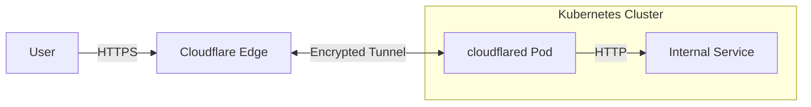

{ .title }

## Introduction

[Cloudflared](https://github.com/cloudflare/cloudflared) is the magic wand for exposing our local services to the world securely. It creates a private tunnel from our Kubernetes cluster directly to the Cloudflare network.

We use it to expose our [Kubernetes](../../Containers/Kubernetes/index.md) services to the internet without opening any public ingress ports. It essentially treats your cluster as if it were part of a private network, with Cloudflare acting as the gateway. This "zero trust" approach significantly reduces our attack surface.

## How it works

Instead of incoming traffic hitting our public IP, `cloudflared` initiates an outbound connection to Cloudflare. Users access our services via Cloudflare's edge, which validates the request and sends it through the established tunnel to our pod.



## Prerequisites

Before installing the chart, we need to create a tunnel in the [Cloudflare Zero Trust Dashboard](https://one.dash.cloudflare.com/) or via the CLI. Since the community helm chart is using "Local Management" (managing config via code), we'll use the CLI.

Following the official documentation, we'll install cloudflared locally to authenticate, generate the tunnel and name it:

```bash
brew install cloudflared
```

Now, we login and create a new tunnel named `my-k8s-tunnel`:

```bash
cloudflared tunnel login
cloudflared tunnel create my-k8s-tunnel
```

You should see output confirming the tunnel creation with its ID:

```bash
$ cloudflared tunnel list
ID                                   NAME          CREATED              CONNECTIONS 
00000000-0000-0000-0000-000000000000 my-k8s-tunnel 2026-01-01T15:22:57Z
```

You'll also have locally 2 files:

```bash
$ ls -l ~/.cloudflared/
cert.pem
00000000-0000-0000-0000-000000000000.json
```

We'll use this files to configure the chart later.

## Configuration

We need to provide the chart with our credentials and define the ingress rules. We'll check the contents of our local credentials files and pass them as secrets (base64 encoded) or values.

Here is a robust `values-overrides.yaml` configuration. Note that we are configuring it for high availability.

=== "values-overrides.yaml"

    ```yaml
    replica:
      allNodes: false
      count: 2

    image:
      repository: cloudflare/cloudflared
      pullPolicy: IfNotPresent

    tunnelSecrets:
      # We inject our specific tunnel credentials here
      # You can get the base64 string via: base64 -i ~/.cloudflared/cert.pem
      base64EncodedPemFile: "add your base64 encoded PEM file here"
      # And: base64 -i ~/.cloudflared/<UUID>.json
      base64EncodedConfigJsonFile: "add your base64 encoded JSON file here"

    tunnelConfig:
      name: "my-k8s-tunnel" # name of the tunnel
      metricsUpdateFrequency: 5s
      autoUpdateFrequency: 24h
      noAutoUpdate: true
      gracePeriod: 30s
      retries: 5
      # auto, http2, h2mux, quic
      protocol: auto
      # info, warn, error, fatal, panic
      logLevel: info
      transportLogLevel: warn
      connectTimeout: 30s
      warpRouting: false
      
    # -- Cloudflare ingress rules. More information can be found here: 
    # https://developers.cloudflare.com/cloudflare-one/connections/connect-networks/configure-tunnels/local-management/configuration-file/#how-traffic-is-matched
    ingress:
      - hostname: "*.mydomain.com" # or "*.example.com" but you must define a CNAME record for "*" to your DNS
        service: http://mygateway.namespace.svc.cluster.local:80 # You can use https port if your want to do end to end encryption
      - hostname: "myservice.mydomain2.com"
        service: http://dedicated-service.namespace.svc:8080
      # -- Catch-all rule for 404s
      - service: http_status:404 
    
    resources:
      requests:
        cpu: 10m
        memory: 128Mi
      limits:
        cpu: 300m
        memory: 128Mi
    ```

Now, let's deploy it:

```bash
helm upgrade --install cloudflared community-charts/cloudflared --values values-overrides.yaml
```

!!! tip

    A good practice is not to expose directly your pods but the Ingress Gateway directly (Nginx, Envoy, Traefik, etc.). So then you manage your own Ingress/Httproutes and Cloudflare will only be a reverse proxy.

    ```mermaid
    graph LR
        CF[Cloudflare] <-->|Tunnel| Cloudflared[Cloudflared Pod]
        Cloudflared -->|Traffic| Gateway[Gateway API or Ingress Gateway]
        Gateway -->|Routing| Service[App Service]
    ```

## DNS Configuration

The final step is to tell Cloudflare to route traffic for our domains through this specific tunnel.

We need to create `CNAME` records pointing to our tunnel's unique address: `<Tunnel-UUID>.cfargotunnel.com`.

| Type | Name | Content | Proxied |
| :--- | :--- | :--- | :--- |
| `CNAME` | `*.mycompany.com` | `00000000-0000-0000-0000-000000000000.cfargotunnel.com` | `Yes` |
| `CNAME` | `myservice.mycompany.com` | `00000000-0000-0000-0000-000000000000.cfargotunnel.com` | `Yes` |

### Bonus: Integration with ExternalDNS and Gateway API

If we are using the Gateway API and `external-dns`, we can automate the DNS record creation.

Add the tunnel address as a target annotation on your Gateway:

```yaml hl_lines="6"
apiVersion: gateway.networking.k8s.io/v1
kind: Gateway
metadata:
  name: internet-gateway
  annotations:
    external-dns.alpha.kubernetes.io/target: "00000000-0000-0000-0000-000000000000.cfargotunnel.com"
spec:
  gatewayClassName: cilium
  addresses:
  - type: IPAddress
    value: 192.168.0.1
  listeners:
    - name: https-mycompany-com
      hostname: "*.mycompany.com"
      port: 443
      protocol: HTTPS
      allowedRoutes:
        namespaces:
          from: All
      tls:
        mode: Terminate
        certificateRefs:
          - name: mycompany-com-tls
```

You enter here the target of your tunnel. Then declare an httproute to create the CNAME record:

```yaml hl_lines="7 9 12-14"
apiVersion: gateway.networking.k8s.io/v1beta1
kind: HTTPRoute
metadata:
  name: internet-facing-wildcards
spec:
  parentRefs:
  - name: internet-gateway # the gateway name
  hostnames:
  - "*.mycompany.com" # the CNAME record we need to create
  rules:
  - backendRefs:
    - name: cilium-gateway-internet-facing # service name of the gateway
      namespace: kube-system # service namespace of the gateway
      port: 443 # service port of the gateway
```

The combination of the Gateway and the HTTPRoute will create the CNAME record for you.

## Best Practices

*   **High Availability**: Use `replica.count: 2` (or more) and `replica.allNodes: false` (Deployment) or `true` (DaemonSet) to ensure the tunnel persists if a node fails.
*   **Protocol**: Setting `protocol: auto` allows Cloudflared to negotiate the best transport (QUIC if possible).
*   **Catch-all Rule**: Always include `- service: http_status:404` at the end of your ingress list.

## Resources
* https://developers.cloudflare.com/cloudflare-one/networks/connectors/cloudflare-tunnel/deployment-guides/kubernetes/
* https://developers.cloudflare.com/cloudflare-one/networks/connectors/cloudflare-tunnel/routing-to-tunnel/
* https://developers.cloudflare.com/cloudflare-one/networks/connectors/cloudflare-tunnel/do-more-with-tunnels/local-management/create-local-tunnel/
* https://community-charts.github.io/docs/charts/cloudflared/usage